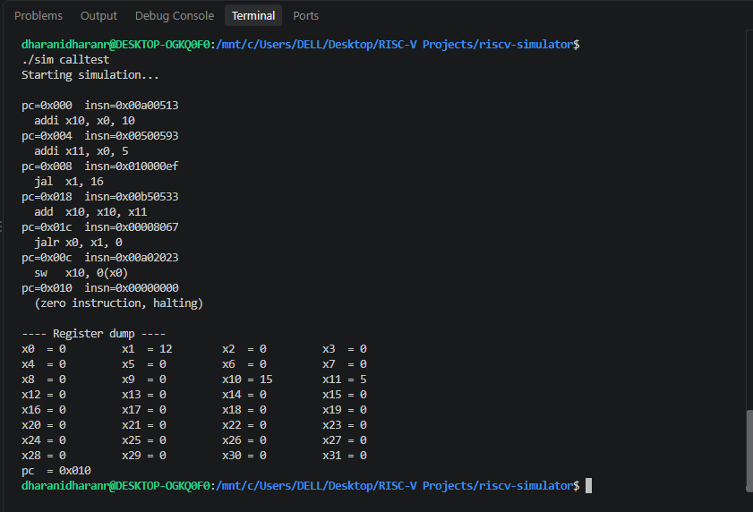

# RISC-V Simulator (RV32I, in C)


A small RISC-V instruction set simulator, written from scratch while learning
the RISC-V ISA. It fetches, decodes (using the same match/mask technique as
the official [Spike](https://github.com/riscv-software-src/riscv-isa-sim)
simulator), and executes real RISC-V machine code, one instruction at a time.

**Implemented instructions:** `add`, `sub`, `addi`, `lw`, `sw`, `beq`, `jal`,
`jalr`, `lui`.



## Contents

- [Requirements](#requirements)
- [Getting started](#getting-started)
- [Two ways to run this](#two-ways-to-run-this)
- [How it works](#how-it-works)
- [Project structure](#project-structure)
- [Challenges I ran into](#challenges-i-ran-into)
- [What I'd add next](#what-id-add-next)

## Requirements

This project uses `make`, `gcc`, and a Linux-style shell.

- **Linux:** already has everything except the RISC-V toolchain (step 4 below).
- **macOS:** run `xcode-select --install` to get `make`/`gcc`, then see step 4.
- **Windows:** `make` and `gcc` are not native Windows tools. Install
  [WSL](https://learn.microsoft.com/en-us/windows/wsl/install) first
  (open PowerShell as Administrator and run `wsl --install`, then restart).
  **Run every command below inside the WSL/Ubuntu terminal**, not
  PowerShell or CMD, they won't recognize `make` or `./sim`.

Once you have a Linux-style shell (native, WSL, or macOS), install the build
tools:
```bash
sudo apt update
sudo apt install build-essential
```
`build-essential` includes both `gcc` and `make`. (macOS users can skip this,
`xcode-select --install` above already covers it.)

## Getting started

### 1. Clone the project
```bash
git clone https://github.com/YOUR-USERNAME/riscv-simulator
cd riscv-simulator
```

### 2. Build the simulator
```bash
make sim
```

### 3. Run the built-in examples
```bash
./sim              # a small addi/add/sub/sw/lw demo
./sim calltest      # a jal + jalr function call and return
./sim luitest        # a lui + addi combined 32-bit constant
```

### 4. Write and run your own program
This step needs the separate RISC-V GNU toolchain (different from the
regular `gcc` installed above, this one targets RISC-V instead of your
own computer's processor):
```bash
sudo apt install gcc-riscv64-unknown-elf
```

- **To use C:** edit `test_program/main.c`, then run:
  ```bash
  make run-c
  ```
- **To use assembly:** edit `test_program/main.s`, then run:
  ```bash
  make run-asm
  ```

Both commands compile your file, convert it into a raw binary, and run it
through the simulator automatically.

**Note:** this is bare-metal, there's no operating system and no C library.
That means no `printf`, and the entry point must be named `_start`, not
`main`. See the comments in `test_program/main.c` for details. Only the nine
instructions listed above are understood, anything else halts the simulator
with an `UNKNOWN instruction` message. Run `make objdump-c` (or
`objdump-asm`) to see exactly what instructions your code compiled to.

## Two ways to run this

There are two separate modes, and they behave differently on purpose:

| Mode | What it shows |
|---|---|
| `./sim`, `./sim calltest`, `./sim luitest` | Fixed, hand-written demos baked into the simulator's own source. Always produce the same trace, useful for checking the simulator itself works, no toolchain required. |
| `make run-c` / `make run-asm` | Compiles whatever is *currently* in `test_program/main.c` or `main.s` using the real RISC-V compiler, then runs the result. The output changes as you edit those files. |

### Example: `./sim calltest`
```
pc=0x008  insn=0x010000ef
  jal  x1, 16
pc=0x018  insn=0x00b50533
  add  x10, x10, x11
pc=0x01c  insn=0x00008067
  jalr x0, x1, 0
pc=0x00c  insn=0x00a02023
  sw   x10, 0(x0)
...
x1  = 12   (the saved return address)
x10 = 15   (10 + 5, computed inside the "function")
```
The PC visibly jumps away with `jal` and lands back exactly where it left
off with `jalr`, a real function call and return.

### Example: `make run-c`, with the default `test_program/main.c`
```
pc=0x000  insn=0x7d000113
  addi x2, x0, 2000
pc=0x004  insn=0x01e00793
  addi x15, x0, 30
pc=0x008  insn=0x10f02023
  sw   x15, 256(x0)
```
Only one `addi` computes the sum, not two `addi`s plus an `add`, because the
RISC-V compiler's optimizer folded `10 + 20` into `30` at compile time. This
is real compiler output, not something the simulator does.

## How it works

Every instruction has a `MATCH` and `MASK` constant, the same technique
Spike uses. An instruction word is identified as, say, `add`, when
`(insn & MASK_ADD) == MATCH_ADD`. See `src/riscv_sim.c` for the full
decode-and-execute loop.

Two different compilers are involved, because two different CPUs are
involved: plain `gcc` builds the simulator itself, which runs directly on
your machine. The separate `riscv64-unknown-elf-gcc` toolchain builds RISC-V
machine code that only the simulator understands, it is never run by your
machine's own CPU directly.

## Project structure

```
riscv-simulator/
├── src/riscv_sim.c     the simulator itself
├── test_program/
│   ├── main.c            editable C input
│   └── main.s              editable assembly input
└── Makefile
```

## Challenges I Ran Into

Building a RISC-V simulator can be tricky. Here are the three main mistakes I made while writing the code and how I fixed them:

### 1. The `jalr` Copy-Paste Mistake
**The Mistake:** At first, my jump instructions (`jalr`) were not working at all. They were accidentally running as addition instructions (`addi`) instead. This happened because I copy-pasted both the mask and match logic from `addi` to reuse it for `jalr`, but I forgot to change the match number (`0x13`). Since the `addi` check came first in my code, it kept stealing all the `jalr` instructions. I only identified this mistake when I was stepping through the code line-by-line during debugging and noticed that the simulator was completely skipping the `jalr` block and jumping straight into the `addi` branch.

**The Fix:** I fixed this by giving `jalr` its own correct opcode value from the encoding table.

### 2. Trying to Handle `LUI` and `ADDI` Together
**The Mistake:** In real RISC-V assembly, we always write an `LUI` instruction followed by an `ADDI` instruction to make a big 32-bit number. Because I knew they worked together, I made a mistake in my C code: I tried to combine them inside the same function. My `LUI` function was looking for a source register (`rs1`) and trying to do the addition logic all at once.

**The Fix:** I realized that a simulator can only read one instruction at a time. `LUI` is its own instruction and does not even have an `rs1` register field. I fixed the C code to make `LUI` completely separate. It now just loads the upper bits, and leaves the addition to be handled by the next `ADDI` instruction in the loop.

### 3. The `LUI` + `ADDI` Sign-Extension Trap
**The Mistake:** I thought that making a full 32-bit number using `LUI` and `ADDI` was just a simple copy-and-paste job. But the 12-bit number inside `ADDI` is signed (it can be negative). If the top bit of that 12-bit number is a `1`, `ADDI` treats it as negative. Instead of adding to the total, it actually subtracts from the upper bits that `LUI` just put there.

**The Fix:** To fix this, you have to add `1` to the `LUI` value whenever the lower number is negative, to cancel out the subtraction. (Note: this adjustment is done ahead of time by the compiler when generating the instructions, not inside our actual simulator code.)

## What I'd add next

- More instructions (`and`, `or`, `xor`, `slt`, `bne`, `blt`, `bge`), each
  implemented and debugged solo before checking against the spec
- A small hand-written assembler, turning `addi x10, x0, 10`-style text into
  machine code automatically
- An interactive step debugger, similar to Spike's own `-d` mode
- Differential testing against real Spike, running the same program on both
  and comparing register state after every instruction
- Basic bounds checking on memory addresses computed by `lw`/`sw`
